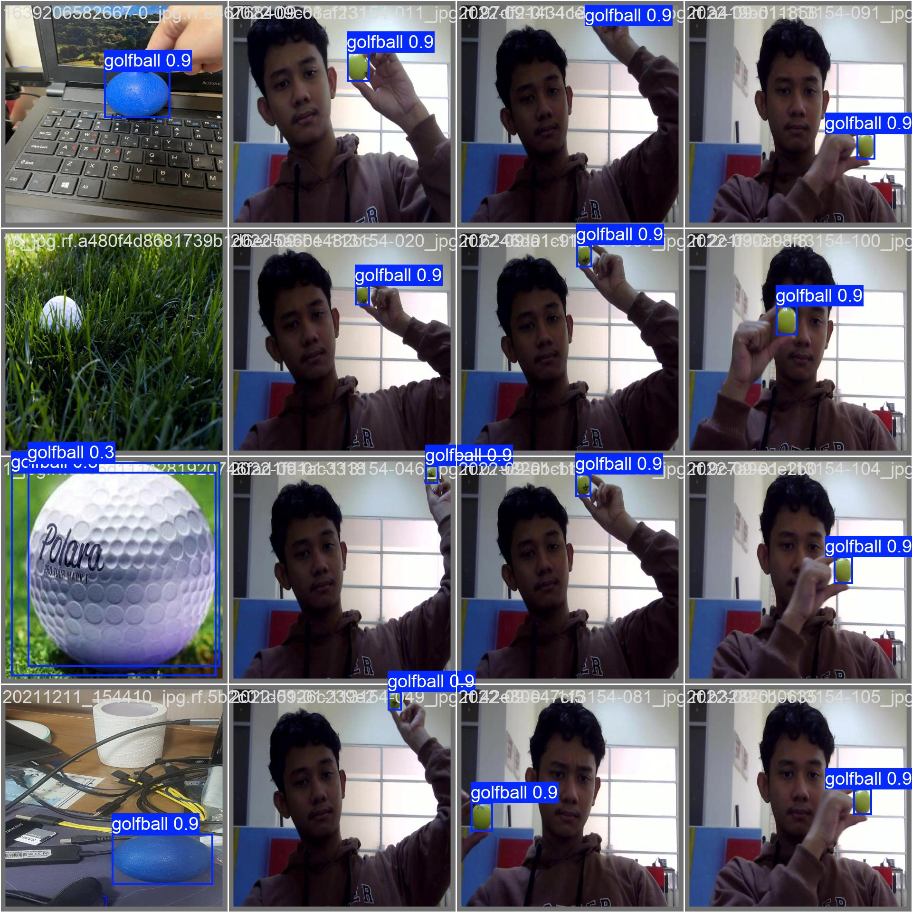

# Golf Swing Analyzer

An AI-powered golf swing analysis tool that automatically detects the key phases of a golf swing from a standard video, overlays biomechanical metrics on each phase frame, and produces an annotated summary image.

Built as part of the Advanced Data Science & AI course at MCI Innsbruck.

---

## What it does

The pipeline takes a single face-on golf swing video and outputs four annotated phase images:

| Phase | What is detected |
|---|---|
| **Address** | Static setup position |
| **Top of Backswing** | Peak of the backswing rotation |
| **Impact** | Moment of club-ball contact |
| **Follow-Through** | Completion of the swing |

Each image is annotated with:
- Live spine line (yellow) and address ghost spine (dashed blue) for comparison
- Shoulder plane (cyan) and hip plane (orange)
- Spine angle arc with degree label
- **BIOMECHANICS HUD** — six metrics with numeric values and phase-specific zone bars (green = good, yellow = acceptable, red = fault)

The six metrics shown are:

| Metric | Description |
|---|---|
| Spine Angle | Lateral tilt of the spine from vertical |
| Spine Delta | Change in spine angle since address |
| Shoulder Tilt | Tilt of the shoulder line from horizontal |
| Hip Tilt | Tilt of the hip line from horizontal |
| Hip Lateral | Lateral hip displacement (sway / slide) |
| Sh/Hip Diff | Shoulder-to-hip rotation separation (X-factor proxy) |

Zone bar thresholds are phase-specific and informed by the biomechanics literature (Bourgain et al., *Sports* 2022).

A separate ball detection script runs the custom-trained YOLO model on a video and outputs an annotated video showing raw detections (red), geometry-filtered candidates (yellow), and temporally confirmed balls (green).

---

## Requirements

- Python 3.11+
- NVIDIA GPU with CUDA (tested on RTX 5060)
- [uv](https://docs.astral.sh/uv/) package manager

---

## Installation

```bash
git clone https://github.com/Misterz1x/golf_swing_analyzer.git
cd golf_swing_analyzer
uv sync
```

---

## Models

Both models must be placed in the `models/` folder at the project root. Download them from the [GitHub Releases page](https://github.com/Misterz1x/golf_swing_analyzer/releases/tag/v1.0).

| File | Purpose | Size |
|---|---|---|
| `models/yolo26x-pose.pt` | YOLO pose model — detects 17-point body skeleton | ~120 MB |
| `models/golf_ball_yolo26x_v2.pt` | Custom-trained golf ball detector (mAP@50 = 0.915) | ~113 MB |

```
golf_swing_analyzer/
└── models/
    ├── yolo26x-pose.pt
    └── golf_ball_yolo26x_v2.pt        ← rename best.pt to this after download
```

> The ball model is referenced in `golf_analyzer/config.py` as `BALL_MODEL_PATH`. If you rename the file differently, update that path.

---

## Usage

### Swing analysis

Analyzes a video and saves four annotated phase images plus a 2×2 summary sheet.

```bash
uv run python golf_analyzer/analyze_swing.py --video "sample_videos/IMG_5887.MOV"
```

Output is saved to `results/` by default. You can change the output directory:

```bash
uv run python golf_analyzer/analyze_swing.py \
    --video "sample_videos/IMG_5887.MOV" \
    --output "results/my_swing"
```

Options:

| Flag | Default | Description |
|---|---|---|
| `--video` | *(required)* | Path to golf swing video |
| `--output` | `./results` | Output directory |
| `--stride` | `3` | Sample every N-th frame (lower = slower, more accurate) |
| `--conf` | `0.3` | Pose detection confidence threshold |

### Ball detection

Runs the ball detection model on a video and saves an annotated output video showing each detection with its confidence score and filter status.

```bash
uv run python detect_golf_ball.py --video "sample_videos/IMG_5887.MOV" --tag test
```

Output is saved to `output_ballv2/IMG_5887_ball_test.mp4`.

Options:

| Flag | Default | Description |
|---|---|---|
| `--video` | *(all in data/our_videos/)* | Path to a specific video |
| `--tag` | *(none)* | Label appended to the output filename to avoid overwrites |
| `--conf` | `0.30` | Detection confidence threshold |
| `--y-min` | `0.25` | Top-of-frame exclusion zone (fraction of frame height) |
| `--track-radius` | `80` | Pixel radius for temporal consistency filter |

**Box colours in the output video:**
- **Red** — rejected by geometry filter (too large, wrong shape, or too high in frame)
- **Yellow** — passed geometry but not yet temporally confirmed (single-frame candidate)
- **Green** — confirmed ball (appeared in same location in ≥ 2 of the last 5 frames)

---

## Sample videos

Four sample videos are included in `sample_videos/` for testing:

| File | Description |
|---|---|
| `IMG_5840.MOV` | Golfer 1 — driver, face-on view |
| `IMG_5884.MOV` | Golfer 2 — iron, face-on view |
| `IMG_5887.MOV` | Golfer 3 — driver, face-on view |
| `IMG_5897.MOV` | Golfer 4 — iron, face-on view |

Videos are slow-motion or real-time depending on the device used.

---

## Project structure

```
golf_swing_analyzer/
├── golf_analyzer/
│   ├── analyze_swing.py       # Main pipeline and CLI
│   ├── phase_detector.py      # Swing phase detection (address, top, impact, follow-through)
│   ├── metrics.py             # Biomechanical metric computation
│   ├── annotator.py           # Frame annotation and HUD rendering
│   └── config.py              # Model paths, keypoint indices, phase-specific thresholds
├── detect_golf_ball.py        # Standalone ball detection script
├── gb_detection_improvement.py # Fine-tuning script for the ball detection model
├── train_golf_ball.py         # Initial training script
├── sample_videos/             # Four sample golf swing videos
├── docs/
│   └── training/              # Ball detection model training metrics and plots
├── golf_biomechanics.pdf      # Reference: Bourgain et al. 2022 systematic review
├── PROJECT_NOTES.md           # Development notes and known issues
├── pyproject.toml
└── uv.lock
```

---

## Ball detection model — training results

The custom ball detection model was fine-tuned from a YOLO base model on the [GolfBallDetector dataset](https://universe.roboflow.com/golf-ball-detector) for 80 epochs at 640 px resolution.

**Final metrics (epoch 80):**

| Metric | Value |
|---|---|
| mAP@50 | **0.915** |
| mAP@50-95 | 0.693 |
| Precision | 0.953 |
| Recall | 0.842 |

Training plots are in [`docs/training/`](docs/training/).




---

## Phase detection approach

Phase detection runs in three steps:

1. **Pose estimation** — YOLO pose model extracts 17-point skeleton on every N-th frame (default stride = 3).
2. **Wrist-Y signal** — the vertical wrist trajectory is smoothed (Savitzky-Golay) and peak-detected to locate address and top of backswing.
3. **Impact refinement** — a priority chain refines impact: wrist-over-ball X crossing (using the ball rest position detected near top of backswing) → wrist-X proxy → velocity-inflection blend fallback.

---

## Reference

Bourgain, M., Rouch, P., Rouillon, O., Thoreux, P., & Sauret, C. (2022). *Golf Swing Biomechanics: A Systematic Review and Methodological Recommendations for Kinematics.* Sports, 10(6), 91. https://doi.org/10.3390/sports10060091
